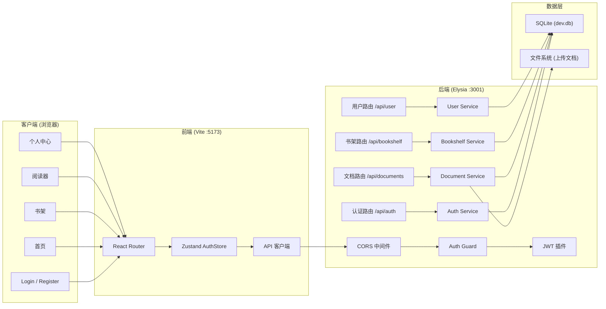
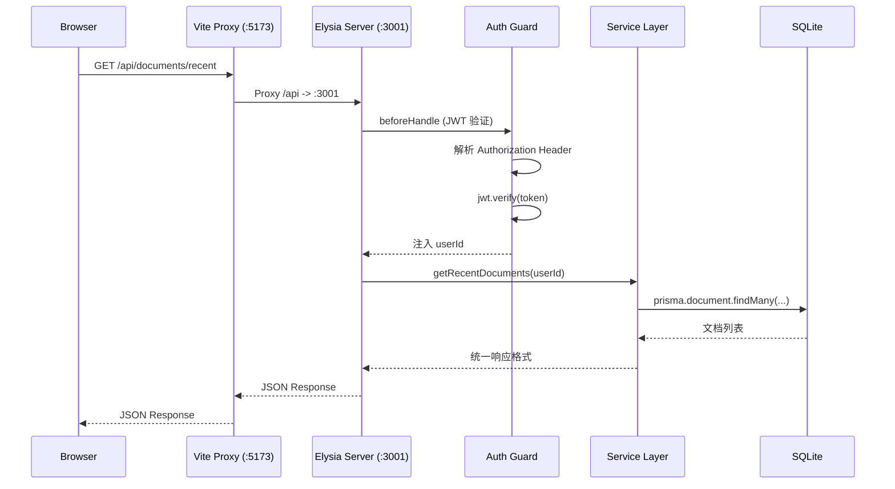

# 系统架构文档

## 概述

Article Reader 是一个移动端优先的文档阅读器应用，支持导入 TXT、PDF、MOBI 格式的文档，提供逐句阅读、阅读进度追踪、书架管理等核心功能。系统采用前后端分离的 Monorepo 架构，后端使用 Elysia (Bun) + Prisma + SQLite，前端使用 React + Vite + TailwindCSS，通过 JWT 实现无状态认证。

目标用户为希望在大段文字中聚焦逐句阅读的人群，通过逐句高亮、阅读速度控制、TTS 语音朗读等特性提升阅读效率。系统以移动端优先设计，前端最大宽度限制为 480px，桌面端模拟手机视口。

## 技术栈

**语言与运行时**
- TypeScript 5.7
- Bun 1.3 (运行时 + 包管理器)

**后端框架**
- Elysia (HTTP 框架，类 Express 风格)
- Prisma 6.19 (ORM)
- SQLite (嵌入式数据库)
- @elysiajs/jwt (JWT 认证)
- @elysiajs/cors (跨域支持)
- bcryptjs (密码哈希)

**前端框架**
- React 19.0
- Vite 6.4 (构建工具)
- TailwindCSS 4.1 (CSS 框架)
- react-router-dom 7.3 (路由)
- Zustand 5.0 (状态管理)

**文档解析**
- unpdf (PDF 文本提取)

## 项目结构

```
article-reader/
├── package.json              # Monorepo 根配置 (Bun workspaces)
├── bun.lock                  # Bun 锁文件
└── packages/
    ├── backend/              # 后端 API 服务 (端口 3001)
    │   ├── prisma/
    │   │   └── schema.prisma # 数据库模型定义 (4 个模型)
    │   └── src/
    │       ├── index.ts      # 应用入口，组装路由与中间件
    │       ├── routes/       # API 路由层
    │       │   ├── auth.ts   # 认证路由 (注册、登录、验证码、重置密码)
    │       │   ├── documents.ts  # 文档路由 (导入、查询、删除)
    │       │   ├── bookshelf.ts  # 书架路由 (增删改查、进度更新)
    │       │   └── user.ts   # 用户路由 (资料、设置)
    │       ├── services/     # 业务逻辑层
    │       │   ├── auth.service.ts
    │       │   ├── document.service.ts
    │       │   ├── bookshelf.service.ts
    │       │   └── user.service.ts
    │       ├── middleware/
    │       │   └── auth.ts   # JWT 鉴权守卫
    │       └── utils/
    │           ├── jwt.ts    # JWT 插件配置
    │           ├── response.ts   # 统一响应格式
    │           └── text-parser.ts # 文本解析 (分句、字数、PDF/MOBI提取)
    └── frontend/             # 前端 SPA (端口 5173)
        ├── index.html
        ├── vite.config.ts    # Vite 配置 (代理 + allowedHosts)
        └── src/
            ├── main.tsx      # 应用入口
            ├── App.tsx       # 路由定义 + 认证保护
            ├── index.css     # 全局样式 + Tailwind 主题
            ├── lib/
            │   ├── api.ts    # API 请求封装
            │   └── utils.ts  # 工具函数 (cn、日期格式化)
            ├── types/
            │   └── index.ts  # TypeScript 类型定义
            ├── store/
            │   └── authStore.ts  # Zustand 状态 (auth + app)
            ├── components/
            │   ├── layout/   # 布局组件 (MainLayout, Header, TabBar)
            │   └── ui/       # 基础 UI 组件 (Button, Card, Dialog, Toast 等)
            └── pages/        # 页面组件
                ├── LoginPage.tsx
                ├── RegisterPage.tsx
                ├── HomePage.tsx
                ├── BookshelfPage.tsx
                ├── DetailPage.tsx
                ├── ReaderPage.tsx
                └── ProfilePage.tsx
```

**入口点**
- `packages/backend/src/index.ts` — 后端应用启动
- `packages/frontend/src/main.tsx` — 前端应用启动
- `packages/frontend/src/App.tsx` — 前端路由定义

## 子系统

### 认证子系统
**目的**: 处理用户注册、登录、Token 签发与验证
**位置**: `packages/backend/src/routes/auth.ts`, `packages/backend/src/services/auth.service.ts`
**关键文件**: `auth.service.ts`, `auth.ts (routes)`, `jwt.ts`
**依赖**: bcryptjs, @elysiajs/jwt
**被依赖**: 所有受保护路由通过 guard 中间件依赖 JWT 验证

### 文档管理子系统
**目的**: 文档导入、解析、查询、删除；支持 TXT/PDF/MOBI 格式
**位置**: `packages/backend/src/routes/documents.ts`, `packages/backend/src/services/document.service.ts`
**关键文件**: `document.service.ts`, `documents.ts (routes)`, `text-parser.ts`
**依赖**: unpdf (PDF 解析), 认证子系统
**被依赖**: 书架子系统 (BookshelfItem 关联 Document)

### 书架子系统
**目的**: 管理用户书架、阅读进度追踪、继续阅读列表
**位置**: `packages/backend/src/routes/bookshelf.ts`, `packages/backend/src/services/bookshelf.service.ts`
**关键文件**: `bookshelf.service.ts`, `bookshelf.ts (routes)`
**依赖**: 文档管理子系统, 认证子系统
**被依赖**: 前端阅读器页面 (ReaderPage)

### 用户设置子系统
**目的**: 管理用户偏好设置 (阅读速度、字号、主题、TTS)
**位置**: `packages/backend/src/routes/user.ts`, `packages/backend/src/services/user.service.ts`
**关键文件**: `user.service.ts`, `user.ts (routes)`
**依赖**: 认证子系统
**被依赖**: 前端阅读器 (ReaderPage 读取速度设置)、个人中心 (ProfilePage)

### 前端应用层
**目的**: 提供移动端优先的阅读体验，包括逐句阅读、阅读器控制、书架管理
**位置**: `packages/frontend/src/`
**关键文件**: `App.tsx` (路由), `authStore.ts` (状态), `ReaderPage.tsx` (阅读器)
**依赖**: 后端 API (通过 Vite 代理转发)
**被依赖**: 无

## 架构图



## 请求流程



## 数据库模型关系

```mermaid
erDiagram
    User ||--o{ Document : "拥有"
    User ||--o{ BookshelfItem : "拥有"
    User ||--|| UserSettings : "拥有"
    Document ||--o{ BookshelfItem : "被引用"

    User {
        string id PK
        string phone UK
        string nickname
        string passwordHash
    }

    Document {
        string id PK
        string userId FK
        string title
        string format
        int wordCount
        string sentences
        string content
    }

    BookshelfItem {
        string id PK
        string userId FK
        string docId FK
        int currentSentence
        float progress
    }

    UserSettings {
        string id PK
        string userId FK UK
        float defaultSpeed
        string fontSize
        string theme
        bool ttsEnabled
    }
```

## 设计决策

- **Monorepo + Bun Workspaces**: 前后端共享 TypeScript 配置，统一依赖管理，避免多仓库同步问题
- **Elysia over Express**: 充分利用 Bun 运行时性能优势，内建 TypeScript 支持和 Schema 验证
- **SQLite 嵌入式数据库**: 个人阅读器应用无需独立数据库服务，SQLite 零配置、便携性强
- **移动端优先设计**: 前端限定 max-width: 480px，桌面端居中模拟手机视口，确保移动端体验一致
- **逐句阅读模式**: 文档导入时预分句 (sentences JSON)，阅读器根据 currentSentence 索引逐句高亮，支持速度控制和 TTS 朗读
- **服务层独立 PrismaClient**: 每个 Service 各自实例化 PrismaClient，虽未使用单例模式但简化了模块独立性
- **JWT 无状态认证**: 7 天有效期，通过 Elysia guard 统一鉴权，公开路由 (/api/auth, /api/health) 在 guard 之前注册
- **Vite 反向代理**: 前端 Vite 配置 `/api` 代理到后端端口，避免 CORS 问题和部署复杂度
