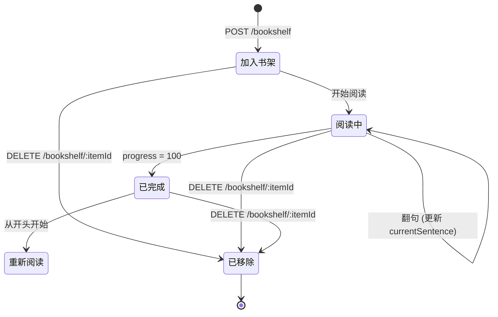

# 书架与阅读进度

书架是用户阅读管理的核心，记录用户正在阅读的文档及其进度。每个用户一个书架，可包含多本文档。

## 书架模型

| 字段 | 类型 | 说明 |
|------|------|------|
| id | cuid | 全局唯一标识 |
| userId | string (FK) | 所属用户 |
| docId | string (FK) | 关联文档 |
| currentSentence | int (default 0) | 当前阅读到的句子索引 |
| progress | float (default 0) | 阅读进度百分比 |
| addedAt | DateTime | 加入时间 |
| lastReadAt | DateTime | 最后阅读时间 |
| createdAt | DateTime | 创建时间 |
| updatedAt | DateTime | 更新时间 |

**唯一约束**: `@@unique([userId, docId])` — 同一用户不能重复添加同一文档

## 代码位置

| 方面 | 位置 |
|------|------|
| 数据模型 | `packages/backend/prisma/schema.prisma` (BookshelfItem) |
| 书架服务 | `packages/backend/src/services/bookshelf.service.ts` |
| 书架路由 | `packages/backend/src/routes/bookshelf.ts` |
| 前端类型定义 | `packages/frontend/src/types/index.ts` (BookshelfItem) |
| 前端书架页 | `packages/frontend/src/pages/BookshelfPage.tsx` |

## 进度计算

阅读进度百分比计算公式:

```
progress = (currentSentence / totalSentences) * 100
```

- `currentSentence` 是用户当前阅读到的句子索引
- `totalSentences` 由文档的 `sentences` JSON 数组长度确定
- 每次阅读器翻句时通过 `PUT /api/bookshelf/:docId/progress` 更新

## 生命周期



## 排序与搜索

书架支持三种排序方式:
- `recent` — 按最近阅读时间降序
- `added` — 按加入时间降序
- `title` — 按文档标题字母升序

搜索通过 `?search=关键词` 参数，按文档标题模糊匹配。

## 继续阅读

`GET /api/bookshelf/continue-reading` 返回最近阅读的 5 本书，按 `lastReadAt` 降序排列。

## 不变量
- 同一用户不能添加同一文档两次 (唯一约束)
- `currentSentence` 必须在文档 sentences 范围内
- `progress` 必须介于 0 到 100 之间
- 删除文档时级联删除对应的书架条目
