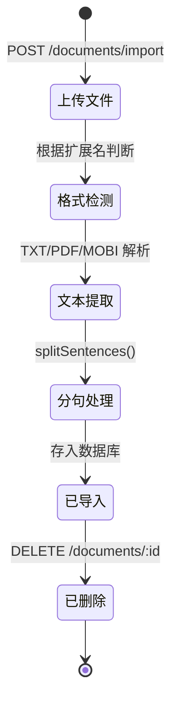

# 文档

文档是用户导入的阅读材料，支持 TXT、PDF、MOBI 三种格式。导入时自动进行文本解析、分句和字数统计。

## 文档模型

| 字段 | 类型 | 说明 |
|------|------|------|
| id | cuid | 全局唯一标识 |
| userId | string (FK) | 所属用户 |
| title | string | 文档标题 (取文件名去扩展名) |
| format | string | 格式 (txt / pdf / mobi) |
| wordCount | int | 总字数 |
| sentences | string (JSON) | 分句数据 JSON 字符串 |
| content | string | 全文原始内容 |
| importedAt | DateTime | 导入时间 |
| createdAt | DateTime | 创建时间 |
| updatedAt | DateTime | 更新时间 |

## 代码位置

| 方面 | 位置 |
|------|------|
| 数据模型 | `packages/backend/prisma/schema.prisma` (Document) |
| 文档服务 | `packages/backend/src/services/document.service.ts` |
| 文档路由 | `packages/backend/src/routes/documents.ts` |
| 文本解析 | `packages/backend/src/utils/text-parser.ts` |
| 前端类型定义 | `packages/frontend/src/types/index.ts` (Document) |
| 前端详情页 | `packages/frontend/src/pages/DetailPage.tsx` |

## 分句数据结构

`sentences` 字段存储为 JSON 字符串，结构如下：

```typescript
interface Sentence {
  index: number;   // 句子序号 (从 0 开始)
  text: string;    // 句子文本
  start: number;   // 原文中的起始位置
  end: number;     // 原文中的结束位置
}
```

## 生命周期



## 支持的文件格式

| 格式 | 扩展名 | 解析方式 |
|------|--------|----------|
| TXT | .txt | 直接读取 + 编码检测 (UTF-8/UTF-16/GBK) |
| PDF | .pdf | 使用 `unpdf` 库提取文本 |
| MOBI | .mobi | 手动解析 PalmDoc 压缩 + MOBI header |

## 关系

- 每个文档属于一个用户 (多对一)，级联删除
- 一个文档可以出现在多个用户的书架中 (一对多)
- 删除文档会级联删除所有关联的书架条目

## 不变量
- `wordCount` 必须与 `content` 的实际字数一致
- `sentences` 必须是有效的 JSON 字符串
- `title` 在同一用户下不强制唯一，但重复检测按标题判断
- 删除文档同时删除关联的书架条目
