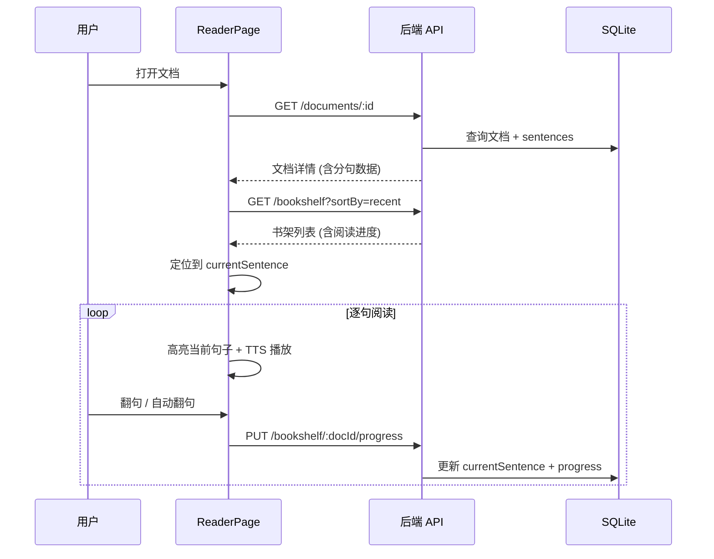

# 阅读器

阅读器是 Article Reader 的核心功能模块，提供逐句高亮阅读体验，支持速度控制、TTS 语音朗读和进度持久化。

## 功能特性

- **逐句高亮**: 文档导入时预分句，阅读时每次高亮当前句子
- **速度控制**: 支持自动翻句，速度可调 (0.5x - 3.0x)
- **TTS 朗读**: 使用浏览器 Web Speech API 朗读当前句子
- **进度保存**: 每次翻句自动同步进度到服务器
- **手动翻句**: 支持上下句手动切换
- **暗色模式**: 支持亮色/暗色阅读主题

## 代码位置

| 方面 | 位置 |
|------|------|
| 前端阅读器页面 | `packages/frontend/src/pages/ReaderPage.tsx` |
| 前端 API 调用 | `packages/frontend/src/lib/api.ts` |

## 阅读器工作流

## 关键交互

### 句子高亮
- 当前句子使用 `.reader-sentence.active` 样式 (缩放动画 + 主题色)
- 已读句子显示为次要文字色
- 未读句子正常显示

### 翻句控制
- 上一句/下一句按钮
- 自动播放模式 (按 speed 间隔自动翻句)
- 进度条可拖拽跳转

### 速度控制
- 默认速度来自用户设置 (`defaultSpeed`)
- 阅读器内可独立调整当前速度
- 速度范围: 0.5x / 1.0x / 1.5x / 2.0x / 2.5x / 3.0x

### TTS 语音
- 使用浏览器 `window.speechSynthesis` API
- 仅在 TTS 启用时播放
- 每次翻句朗读当前句子文本

## 不变量
- `currentSentence` 索引不能超出文档 sentences 数组范围
- 翻句后必须同步更新后端进度
- 阅读器页面需要在 URL 中传入 `:docId` 参数
