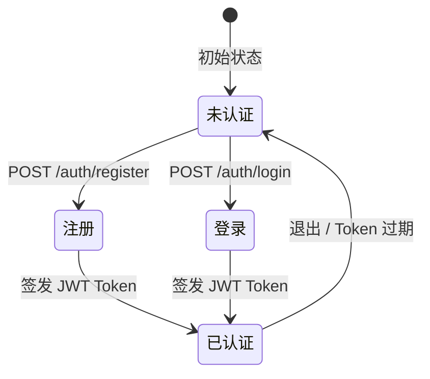

# 用户与认证

用户是系统的核心实体，通过手机号注册，使用 JWT Token 进行无状态认证。每个用户拥有独立的文档库、书架和个性化设置。

## 用户模型

| 字段 | 类型 | 说明 |
|------|------|------|
| id | cuid | 全局唯一标识 |
| phone | string (unique) | 手机号，用于登录 |
| nickname | string | 显示昵称 |
| passwordHash | string | bcrypt 哈希密码 |
| createdAt | DateTime | 注册时间 |
| updatedAt | DateTime | 最后更新时间 |

## 代码位置

| 方面 | 位置 |
|------|------|
| 数据模型 | `packages/backend/prisma/schema.prisma` (User) |
| 认证服务 | `packages/backend/src/services/auth.service.ts` |
| 用户服务 | `packages/backend/src/services/user.service.ts` |
| 认证路由 | `packages/backend/src/routes/auth.ts` |
| 用户路由 | `packages/backend/src/routes/user.ts` |
| JWT 配置 | `packages/backend/src/utils/jwt.ts` |
| 前端认证状态 | `packages/frontend/src/store/authStore.ts` |
| 前端登录/注册 | `packages/frontend/src/pages/LoginPage.tsx`, `RegisterPage.tsx` |
| 前端个人中心 | `packages/frontend/src/pages/ProfilePage.tsx` |

## 认证流程

### 密码规则
- 长度 8-20 位
- 必须包含字母和数字
- 使用 bcrypt (salt rounds = 10) 存储

### Token 管理
- JWT 有效期 7 天
- 签名密钥来自环境变量 `JWT_SECRET`，后备值为 `article-reader-jwt-secret-key-2026`
- Token 存储在 `localStorage` (键名 `"token"`)
- 前端每次 API 请求自动注入 `Authorization: Bearer <token>`

## 用户设置

每个用户注册时自动创建默认设置记录。

| 字段 | 类型 | 默认值 | 说明 |
|------|------|--------|------|
| defaultSpeed | Float | 1.0 | 默认阅读速度 (0.5-3.0) |
| fontSize | String | "medium" | 字号 (small/medium/large) |
| theme | String | "light" | 主题 (light/dark) |
| ttsEnabled | Boolean | false | TTS 语音朗读开关 |

设置通过 `GET/PUT /api/user/settings` 接口读写，支持部分更新。

## 不变量
- 手机号在系统中必须唯一
- 每个用户只能有一个设置记录 (一对一关系)
- 注册后自动创建设置记录，确保设置永不缺失
- 删除用户会级联删除其所有文档、书架条目和设置
